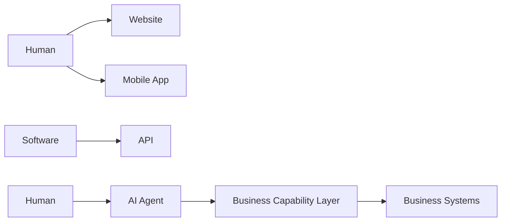
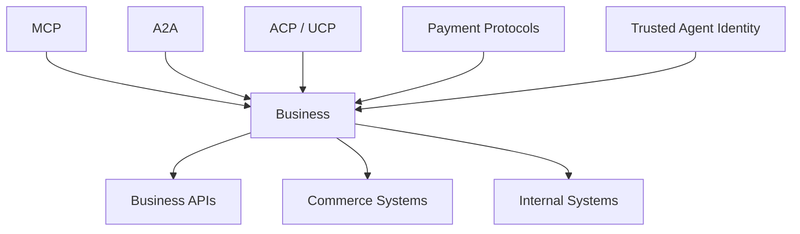
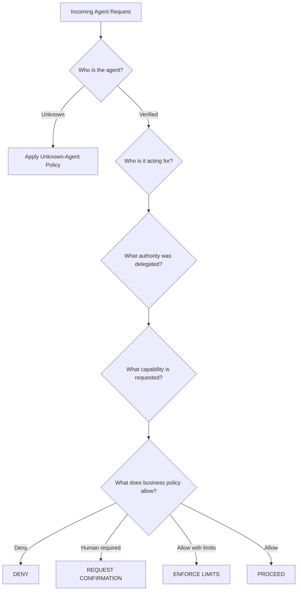
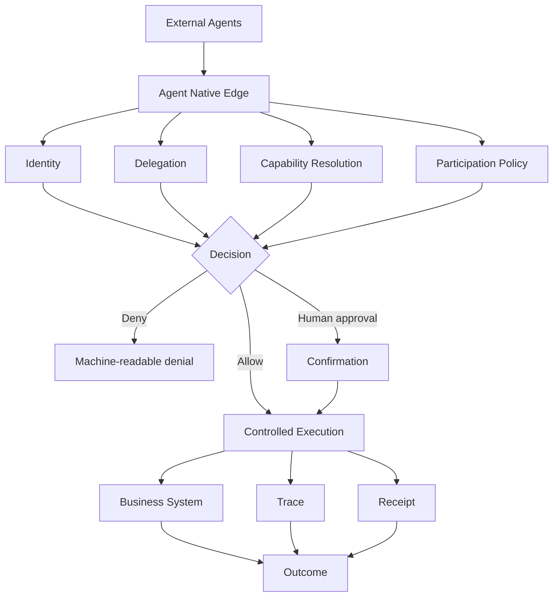
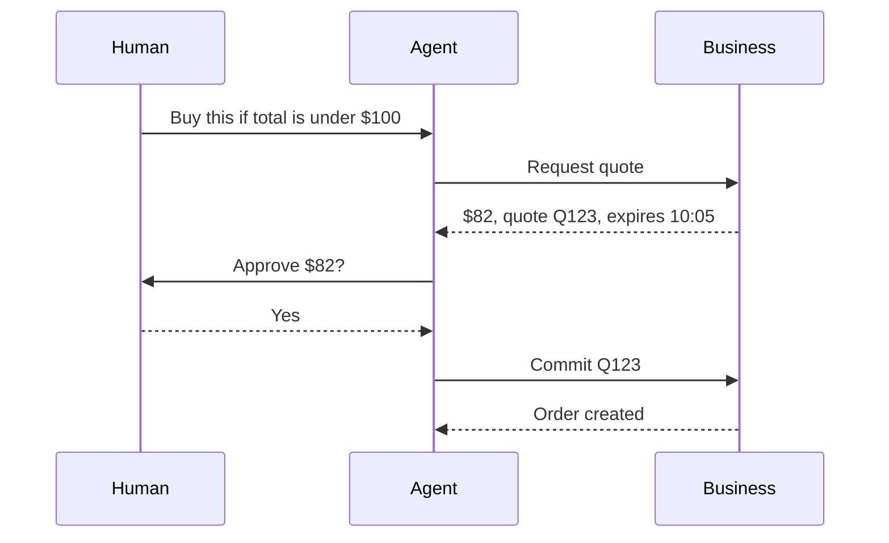
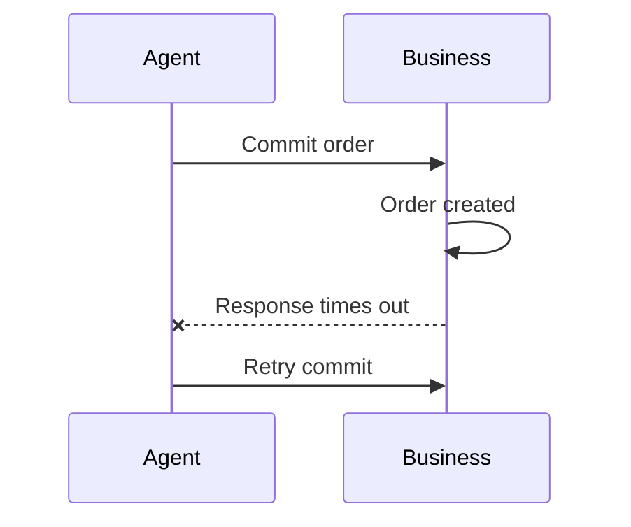
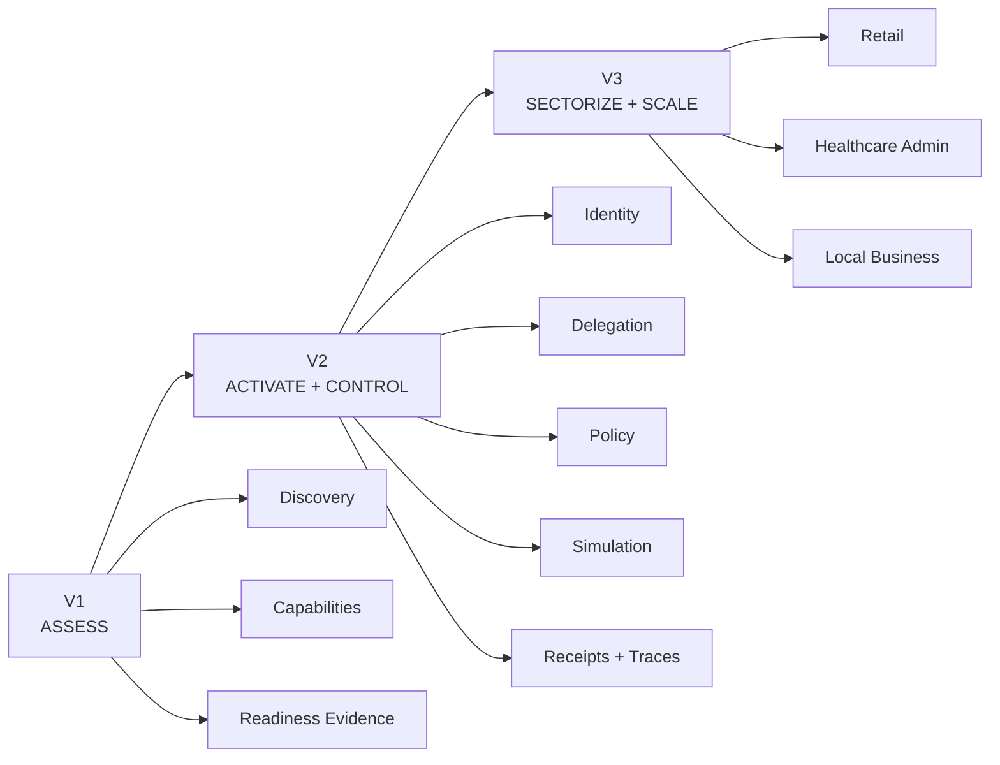
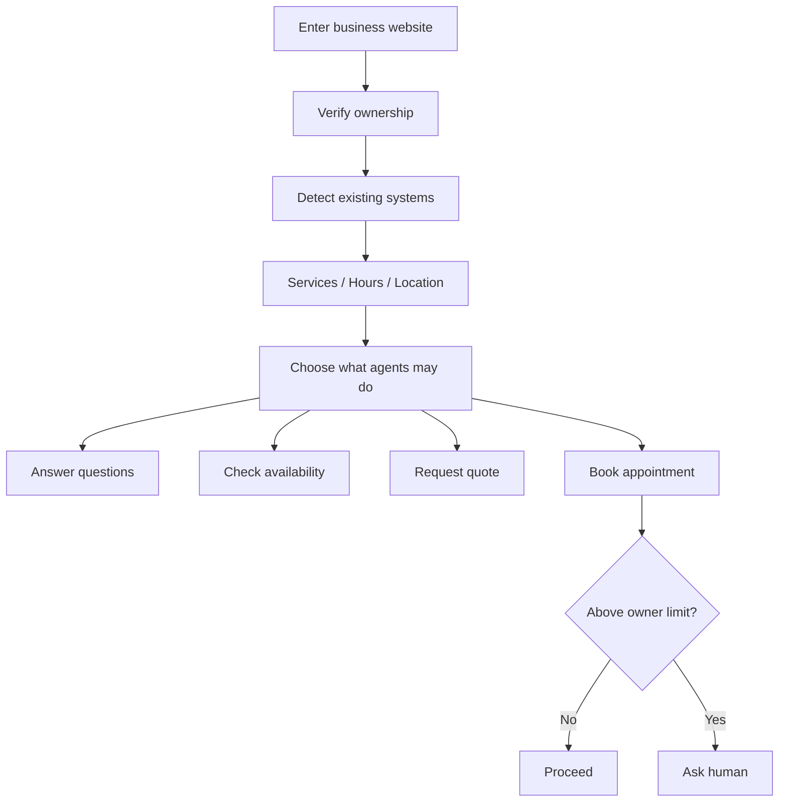
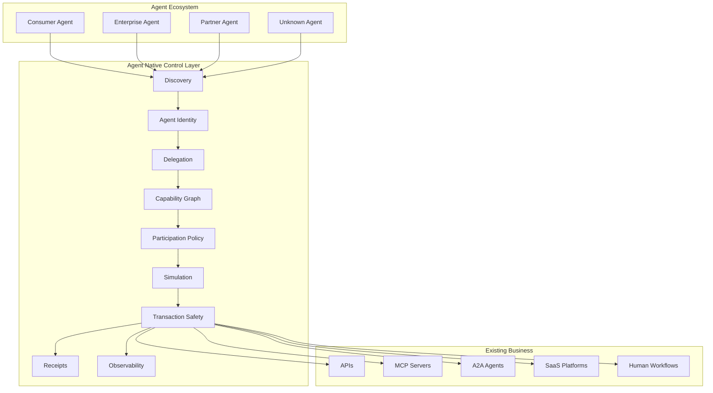

# The Agent Economy Needs More Than Agents

**Agent Native, Part II — From readiness to participation**

*What happens when software stops merely reading the internet and starts acting on it? The interesting problem is no longer whether an agent can reach your business. It is whether the business can recognize the agent, understand its authority, decide what it is allowed to do, recover when something goes wrong, and prove what actually happened.*

---

In the first version of Agent Native, I started with a deliberately simple question:

> **Can an AI agent actually do business with you?**

That question turned into a scanner.

Agent Native v1 looks at a business from the outside. It asks whether an agent can discover a machine-readable interface, understand the available capabilities, identify authentication and authorization requirements, distinguish reads from mutations, find recovery semantics, and inspect enough evidence to make a useful readiness judgment.

It was intentionally passive.

No login. No checkout. No "we placed three orders just to make sure idempotency works." The internet has enough surprises already.

That first version taught me something more important than the scanner itself:

> **Agent readiness is not really a website problem. It is the beginning of a new business-interface problem.**

If the agent economy becomes real, agents will not just summarize websites. They will represent people and organizations. They will search, negotiate, schedule, reserve, buy, cancel, request, submit, compare, coordinate, and occasionally do something expensive at exactly the wrong time.

That means the next version of the internet needs more than smarter agents.

It needs businesses that know how to participate.

And that is where I think Agent Native becomes much more interesting.

---

## The web was built for people. The next interface is being built for delegated software.

The internet has gone through several interface shifts.

The early web was primarily designed around people navigating pages.

Then mobile applications became another major interface.

Then APIs separated business capabilities from user interfaces and allowed software systems to interact directly.

Agents introduce another abstraction.



The difference is subtle but important.

Traditional software usually calls an API because a developer explicitly programmed it to call that API.

An agent may decide dynamically:

- which business to use,
- which capability to invoke,
- what information it needs,
- whether it should retry,
- whether it needs permission,
- whether another agent should be involved,
- and whether it should ask the human before continuing.

That is a very different operating model.

The business is no longer only serving:

```text
Human → Interface
```

or:

```text
Application → API
```

It may increasingly serve:

```text
Human
  ↓
Delegated Agent
  ↓
Business Capability
  ↓
Transaction / Action
  ↓
Evidence back to Human
```

That last line matters.

If an agent acts for me, I need more than "it probably worked."

I need to know:

- What did it ask for?
- What authority did it have?
- What did the business allow?
- What changed?
- What did it cost?
- What happens if the response timed out?
- Can it be undone?
- Who do we call when everything is technically valid and still somehow wrong?

We have spent years making APIs callable.

The agent economy needs to make actions **delegatable**.

Those are not the same thing.

---

## Protocols are appearing quickly. That is good. It is also not enough.

A lot of the foundational plumbing is now emerging.

The Model Context Protocol gives agents a standardized way to interact with tools, resources, and other external capabilities. Its 2026 revision added a stateless core, stronger authorization behavior, extensions, routing improvements, and other changes aimed at production deployments.[^1]

A2A provides a common interaction model for independent agents to discover capabilities, exchange information, and coordinate tasks without sharing their internal implementation.[^2]

Commerce is developing its own layer.

OpenAI's Agentic Commerce Protocol focuses on structured merchant data and commerce interactions.[^3] Shopify and Google developed the Universal Commerce Protocol around interoperable discovery, checkout, order, fulfillment, payment, and post-purchase capabilities.[^4] Stripe's Machine Payments Protocol goes further into machine-native payments.[^5]

Visa's Trusted Agent Protocol attacks another problem entirely: how does a merchant distinguish a legitimate agent acting with commerce intent from ordinary automation, a scraper, or something actively hostile?[^6]

This is exactly the direction I hoped to see.

But it exposes the next missing layer.



Protocols tell systems **how to communicate**.

They do not automatically answer:

> **Should this agent be allowed to perform this action, for this user, on this resource, at this value, right now?**

That is the control problem.

And I think it will become one of the defining infrastructure problems of the agent economy.

---

# Agent native does not mean "let every agent in"

This is one of the biggest changes in how I think about the project.

My first instinct was:

> Make businesses easier for agents to discover and use.

That is still useful.

But "more agent access" is not automatically progress.

Imagine a retailer.

It may want an unknown agent to search its catalog.

It may let a recognized consumer agent check availability.

It may let a trusted commerce agent create a cart.

It may require explicit user confirmation before a purchase.

It may allow a partner agent to perform a return under certain thresholds.

It may let its own internal agent do considerably more.

That policy might look like this:

| Capability | Unknown Agent | Verified Consumer Agent | Partner Agent | Internal Agent |
|---|---|---|---|---|
| Search products | Allow | Allow | Allow | Allow |
| Check inventory | Limited | Allow | Allow | Allow |
| Get personalized pricing | Deny | Scoped | Scoped | Allow |
| Create cart | Deny | Allow | Allow | Allow |
| Purchase | Deny | Human confirmation | Limited autonomy | Allow |
| Refund | Deny | Human confirmation | Limited | Allow |
| Access customer data | Deny | Scoped | Scoped | Scoped |

This is more interesting than a readiness score.

It is an **agent participation policy**.

And it turns the question from:

> Are we agent ready?

into:

> **How do we want agents to participate in our business?**

That is a strategy question, an architecture question, a security question, and increasingly a product question.

---

# Identity is not authorization

This sounds obvious until systems accidentally collapse the two.

Suppose an incoming request really is from a trusted AI provider.

Excellent.

We have answered:

> Who sent this?

We have not answered:

> Is this agent acting for Revanth?

We definitely have not answered:

> Did Revanth authorize it to spend $1,200?

And we still have not answered:

> Does the merchant permit this agent to buy that item under these conditions?

The decision chain looks more like this:



I have started thinking about this as four different questions:

1. **Identity** — Who is this agent?
2. **Delegation** — Who authorized it, and for what?
3. **Policy** — What does this business permit?
4. **Execution safety** — Can this action happen without creating an operational mess?

Collapsing these into a single `isTrusted=true` field would be wonderfully convenient.

It would also be a terrible idea.

---

# The agent economy needs a business-side control plane

This is the direction Agent Native is evolving toward.

Version 1 is an assessment layer.

The next layer is a **business-side control plane for agent participation**.



The word **control** matters.

Agent Native should not become another agent framework.

The world is not suffering from an acute shortage of frameworks that can call tools.

The business-side problem is different.

A company needs a way to answer:

- Which agent is this?
- Which provider operates it?
- Which user or organization is it representing?
- What permission has actually been delegated?
- Which capability is being requested?
- Is that capability read-only, reversible, expensive, sensitive, or destructive?
- Does policy permit it?
- Does it require a human?
- Is the request replayed?
- If the request is retried, will we accidentally execute it twice?
- Can we prove what happened afterward?

That is not a chatbot.

That is infrastructure.

---

# A transaction is where all the nice diagrams become real

Discovery is comparatively forgiving.

If an agent misunderstands a product description, that is annoying.

If it misunderstands `POST /transfer`, we have entered a different genre of software engineering.

The moment an agent can change state, several old distributed-systems problems become agent-economy problems.

Consider a purchase.



Easy enough.

Now change one thing.



Did we create one order?

Two?

Did the second request receive the first result?

Can the agent safely retry?

Did the user approve one purchase or an unlimited number of identical purchases until the Wi-Fi became emotionally stable?

This is why things like idempotency, quote expiration, confirmation binding, compensation, and receipts are not edge-case polish.

They are part of making delegated action trustworthy.

---

# The receipt may become one of the most important objects in the agent economy

When humans click buttons themselves, intent is often inferred from interaction.

When agents act for humans, that inference becomes weaker.

I think consequential agent actions increasingly need something closer to a structured receipt.

Not just:

```text
Success: true
```

but:

```text
Who acted?
For whom?
Under which grant?
Against which policy?
What was approved?
What changed?
At what value?
Which resource?
What was the outcome?
Which trace proves it?
```

Conceptually:

```yaml
receipt_id: rcp_123
agent: agent_xyz
principal: user_abc
capability: purchase
policy_version: 14
delegation: grant_789
confirmation: confirmation_456
quote: quote_123
value: 82.00
currency: USD
result: SUCCEEDED
trace_id: trace_999
```

The exact schema will evolve.

The principle is more important:

> **Autonomous action should leave evidence.**

If agents increasingly operate on our behalf, "trust me, the model handled it" is not an audit strategy.

---

# The architecture I am working toward

Agent Native is evolving in three stages.



### V1 — Assess

Can agents understand the business?

That is the version I wrote about previously: passive inspection, deterministic checks, evidence, limitations, and no fake global score.

### V2 — Activate and control

Can the organization safely allow real agent participation?

This adds:

- richer protocol adapters,
- agent identity,
- ownership verification,
- delegated authority,
- participation policy,
- controlled simulation,
- transaction-safety testing,
- receipts,
- observability.

### V3 — Sectorize and scale

What does agent-native participation actually mean for a retailer, healthcare organization, restaurant, plumber, bank, airline, or professional-services firm?

The horizontal core should remain the same.

Sector-specific capabilities, policies, workflows, and failure modes become extension packs.

That distinction is important.

I do not want:

```text
Agent Native Retail
Agent Native Healthcare
Agent Native Dentist
Agent Native Plumber
Agent Native Whatever-We-Thought-Of-This-Week
```

I want:

```text
One control architecture
        ↓
Sector-specific capability and policy packs
```

Otherwise this turns into a very impressive collection of `if sector == ...` statements.

---

# Retail makes the transaction problem obvious

Retail is probably the easiest sector to visualize.

An agent should eventually be able to:

```text
discover
→ compare
→ check inventory
→ get price
→ create cart
→ request quote
→ purchase
→ track
→ cancel
→ return
```

The protocols are already moving in this direction.

UCP defines interoperable commerce capabilities and dynamic negotiation between merchants and agents.[^4]

ACP creates structured commerce infrastructure between merchants and agent experiences.[^3]

Stripe is building agent-oriented payment infrastructure, including MPP and scoped payment mechanisms.[^5]

Visa is working on merchant-side recognition of trusted agents.[^6]

These are important pieces.

Agent Native's question sits across them:

> **How does the merchant know that the whole interaction is safe enough to allow?**

For example:

```text
Agent discovers item at $70
        ↓
User approves purchase
        ↓
Price changes to $95
        ↓
Commit?
```

Or:

```text
Order succeeds
        ↓
Response disappears
        ↓
Agent retries
        ↓
One order or two?
```

Or:

```text
Agent verified
        ↓
User delegated $100
        ↓
Purchase request = $900
        ↓
Absolutely not.
```

The hard part is rarely the `POST`.

The hard part is the contract around the `POST`.

---

# Healthcare makes the trust boundary obvious

Healthcare stresses a different part of the architecture.

The first useful agent-native healthcare workflows may not be autonomous diagnosis.

They may be considerably less dramatic:

- find a provider,
- check availability,
- schedule an appointment,
- reschedule,
- retrieve authorized administrative information,
- navigate billing,
- request records,
- request human support.

Even those require careful separation between:

```text
Agent identity
Patient identity
Patient authorization
Purpose
Allowed data
Allowed action
```

A verified agent is not automatically entitled to protected patient information.

And a patient-authorized agent requesting appointment availability is not automatically authorized to retrieve an entire clinical history.

The more consequential the capability becomes, the tighter the autonomy boundary should become.

That is exactly why I want sector packs to sit on top of a common identity, delegation, policy, evidence, and observability layer.

---

# Local businesses expose the adoption problem

The plumber should not need a whiteboard session on OAuth resource indicators before an agent can request a Tuesday appointment.

If the agent economy only works for companies with sophisticated platform teams, it is not much of an economy.

For a local business, the experience should eventually look more like this:



The system might discover that the business already runs on a platform capable of providing scheduling, payment, inventory, or order APIs.

Great.

Use that.

"Agent native" should not mean "everyone gets a custom microservice."

Sometimes the most intelligent architecture is the one you do not build.

---

# The participation strategy may matter more than the protocol

I think businesses will eventually choose among a few broad strategies.

### Direct

Expose first-party agent interfaces.

Best when the business has strong engineering capabilities and wants maximum control.

### Platform-mediated

Use an existing commerce, scheduling, POS, payment, booking, or SaaS platform as the agent-facing layer.

Often the right answer for smaller organizations.

### Aggregator or marketplace

Participate through an intermediary that already owns discovery or transaction infrastructure.

### Human handoff

Let the agent discover, collect context, or initiate the workflow, then hand control to a person for the consequential step.

This last option is underrated.

Agent-native does not mean autonomous everything.

A machine-readable:

```text
HUMAN_APPROVAL_REQUIRED
```

is considerably better than an agent guessing whether it is allowed to proceed.

---

# I do not want an "Agent Native Score"

I still believe this strongly.

The deeper I get into the project, the less useful one number looks.

Imagine:

```text
Discovery                L5
Capability semantics     L4
Agent identity           L2
Delegated authority      L1
Transaction safety       L3
Recovery                 L2
Observability            L1
```

That tells me something.

Now compress it into:

```text
Agent Ready: 78 / 100
```

Wonderful.

We have successfully made the problem easier to put in a PowerPoint and harder to reason about.

The agent economy needs explicit weaknesses, not reassuring averages.

A company should know:

> We are excellent at discovery and poor at delegated authority.

That is actionable.

---

# What makes this different from "Agent SEO"

There will almost certainly be a market around making businesses visible to agents.

That is useful.

It is also only the first layer.

SEO asks:

> Can the machine find me?

Agent-native infrastructure asks:

> Can the machine understand what I can do, prove who it represents, operate within my policies, act safely, recover from failure, and produce evidence?

```text
Agent SEO
    ↓
Find me

Agent Readiness
    ↓
Understand me

Agent Activation
    ↓
Interact with me

Agent Control
    ↓
Act within authority

Agent Operations
    ↓
Recover, trace, prove
```

The deeper layers are where the engineering gets harder.

Naturally, that is also where I became more interested.

---

# Why I think this matters

The agent economy will not come to life merely because models become smarter.

Models can become extremely capable and still run into a business internet that cannot answer basic questions about delegated action.

An agent might know perfectly well how to buy a product.

That does not mean the merchant knows:

- whether the agent is legitimate,
- whether the customer authorized it,
- whether the payment is scoped,
- whether the transaction is retry-safe,
- whether the agent crossed an autonomy limit,
- whether a human should intervene,
- or whether the final result can be audited.

That infrastructure has to exist somewhere.

And it should not be reinvented differently inside every agent.

The business needs its own side of the contract.

That is the larger vision behind Agent Native.

---

# The long-term architecture

The picture I increasingly have in mind looks like this:



The protocols remain important.

But Agent Native should sit **above and across them**, translating a mess of protocol-specific capabilities into one business question:

> **What is this agent allowed to do here, and can we prove the result?**

---

# What I am building next

The next version is intentionally harder than the first.

I am working through the layers in order.

First:

```text
Protocol interoperability
→ OpenAPI
→ MCP
→ A2A
→ Canonical capabilities
```

Then:

```text
Business ownership
→ Agent identity
→ Request integrity
→ Delegated authority
→ Participation policy
```

Then:

```text
Verified simulation
→ Preview / commit
→ Confirmation
→ Idempotency
→ Failure injection
→ Compensation
→ Receipts
→ Tracing
```

And only then:

```text
Sector packs
→ Retail
→ Healthcare administration
→ Local business
→ eventually others
```

The order matters.

If identity and delegation are weak, building autonomous transactions on top of them is just a faster way to discover why security architecture exists.

---

# The harder question

The first article asked:

> **Can an AI agent actually do business with you?**

I still think that is the right starting point.

But the question I care about now is bigger:

> **Can your business participate in an economy of autonomous software without giving up control?**

That requires more than a good model.

It requires:

- interoperability,
- identity,
- delegation,
- policy,
- transaction semantics,
- recovery,
- evidence,
- observability,
- human control.

In other words, all the unglamorous infrastructure that tends to appear immediately after the demo works.

That is usually where the interesting engineering begins.

---

# Final thought

The future internet may have two customers at once.

The human has the intent.

The agent has the delegated ability to act.

The business has the responsibility to decide what happens next.

If the agent economy is going to become real, those three parties need a contract that software can understand.

Not a terms-of-service page.

Not a chatbot.

Not a trust-us badge.

A real technical contract:

```text
Who are you?
Who sent you?
What are you allowed to do?
What am I willing to let you do?
What changed?
Can it be undone?
And where is the receipt?
```

That is the internet I want Agent Native to help build.

Preferably before someone's agent orders twelve sofas because the first eleven requests timed out.

---

## Sources and further reading

[^1]: Model Context Protocol, **The 2026-07-28 Specification** — https://blog.modelcontextprotocol.io/posts/2026-07-28/

[^2]: Agent2Agent Protocol, **A2A Protocol Specification — latest released version 1.0.0** — https://a2a-protocol.org/dev/specification/

[^3]: OpenAI, **Agentic Commerce Protocol** — https://developers.openai.com/commerce

[^4]: Shopify, **Universal Commerce Protocol** — https://www.shopify.com/ucp

[^5]: Stripe, **Introducing the Machine Payments Protocol** — https://stripe.com/blog/machine-payments-protocol

[^6]: Visa Developer, **Trusted Agent Protocol — Merchant Specifications** — https://developer.visa.com/capabilities/trusted-agent-protocol/trusted-agent-protocol-specifications

---

## About Agent Native

Agent Native is an open-source project exploring what businesses need in order to participate safely in an agent-mediated economy.

The first release focuses on passive, evidence-backed readiness assessment.

The broader roadmap extends that foundation into protocol interoperability, identity, delegated authority, participation policy, controlled simulation, transaction safety, receipts, observability, and sector-specific activation.

Project: https://github.com/revanthpp/agent-native

Original article: https://www.revanthpp.com/writing/can-an-ai-agent-actually-do-business-with-you/
