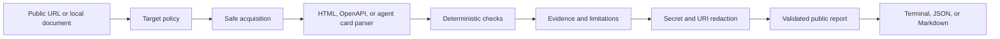

# Agent Native

## Can an AI agent actually do business with you?

That is the question. Agent Native checks whether a business is ready for software agents to discover it, understand it, and use it through documented interfaces.

It does not hand out a mystery score. It produces evidence, check results, limitations, and a report that a person can inspect. Less magic. More receipts.

## What it does

Agent Native passively reviews public business surfaces such as:

- a website or other public URL
- an OpenAPI document
- an agent card
- ordinary page text that explains what the business does

It checks for practical signals, including:

- whether the business is understandable to an agent
- whether an API is described clearly enough to use
- whether an agent-facing discovery surface exists
- whether the published interface exposes useful capabilities
- whether public content contains credentials that should not be public
- whether the requested target appears to be a private network address

The tool reports what it found. It does not claim that a passing check means the business is ready for every possible agent, because that would be a very confident sentence.

## The short version

```text
public target -> fetch safely -> parse -> run checks -> redact -> report
```

The scan is passive. It does not log in, submit forms, purchase anything, call business actions, or modify the target.

## How the pieces fit



The important boundary is between evidence and the public report. Internal evidence can be useful during a scan. It must not leak secrets into the output. Agent Native sanitizes the report, then validates the rendered output again before showing it.

## A slightly more technical view

```text
CLI
 |
 v
Scanner
 |-- target policy and network boundary
 |-- acquisition
 |-- parsers
 |-- check engine
 |-- evidence model
 |-- safe report builder
      |-- canonical secret detection
      |-- URI sanitization
      |-- final output validation
 |
 +--> terminal / JSON / Markdown
```

The project favors deterministic checks over a single score. That makes results easier to test, compare, explain, and challenge when a check gets something wrong.

## Try it

Python 3.10 or newer is recommended.

```bash
git clone https://github.com/revanthpp/agent-native.git
cd agent-native
python -m venv .venv
source .venv/bin/activate
python -m pip install -e .
```

Scan a public URL:

```bash
agentnative scan https://example.com
```

Write JSON or Markdown to a file:

```bash
agentnative scan https://example.com --format json --output report.json
agentnative scan https://example.com --format markdown --output report.md
```

Run the built-in help when you forget an option. This is expected. Nobody remembers every CLI flag.

```bash
agentnative --help
agentnative scan --help
```

## What the output means

Each check reports a status and evidence. The main statuses are:

- `PASS`: the expected signal was found
- `WARN`: the signal is incomplete or deserves attention
- `FAIL`: the signal was not found or a safety condition stopped the check
- `NOT_APPLICABLE`: the check does not apply to the target
- `ERROR`: the check could not complete as expected

The report also includes limitations. If the server blocks access, the document is incomplete, or a check cannot prove something, the report says so.

## Security boundary

Agent Native is designed for passive assessment. It has controls for:

- private and loopback network targets
- redirects and target policy
- credential and token detection
- single and double URL encoding
- URI user information, query parameters, paths, and fragments
- safe public report construction
- final rendered-output validation

If you are testing with deliberately unsafe fixtures, keep them in the evaluation corpus. Do not put real credentials in issues, pull requests, examples, or test data. The internet already has enough accidental passwords.

Read [SECURITY.md](SECURITY.md) before reporting a vulnerability. Read [docs/security/THREAT_MODEL.md](docs/security/THREAT_MODEL.md) for the security assumptions and boundaries.

## Project map

| Path | Why it exists |
| --- | --- |
| `src/agentnative/` | Application code |
| `tests/` | Unit, integration, security, and evaluation tests |
| `evals/` | Reference businesses, adversarial fixtures, and acceptance data |
| `docs/` | Architecture, threat model, requirements, and design decisions |
| `examples/` | Small example business surfaces |
| `FINAL_INDEPENDENT_QA_V3_1.md` | Latest independent QA evidence |
| `V1_RELEASE_REVIEW.md` | Release decision and verification record |

## Development

Run the test suite:

```bash
PYTHONPATH=src:. python -m unittest discover -s tests
```

Build and inspect the package:

```bash
python -m build
python -m pip check
```

Please read [CONTRIBUTING.md](CONTRIBUTING.md) before opening a pull request. Small, focused changes are easier to review and less likely to create a new mystery in the report.

## Release status

The first public release is `v1.0.0`. The release review records the test results, security checks, packaging checks, known limitations, and final repository state.

## License

Apache 2.0. See [LICENSE](LICENSE).
